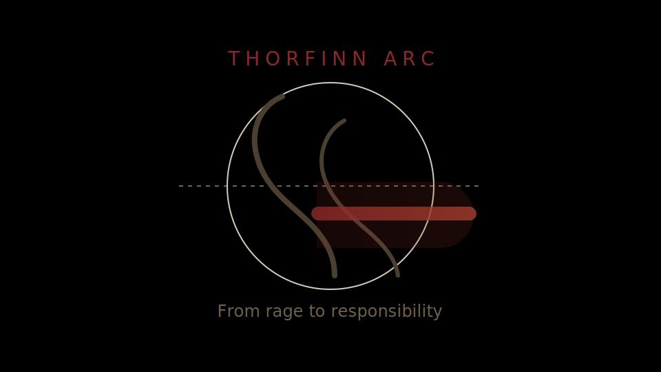
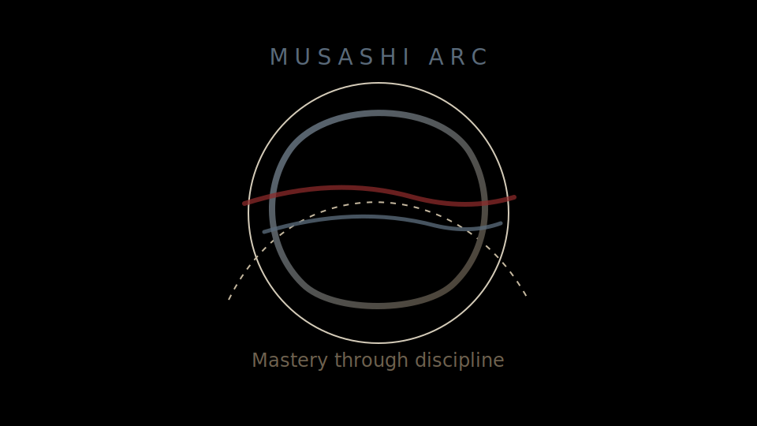

# ⚔️ SAGA — The Path of Self-Mastery

> *"A true warrior needs no blade."* — **Thors**

SAGA is a self-mastery web app inspired by the growth arcs of **Thorfinn** and **Musashi**. Journal with clarity, plant daily habits, climb your long-term analytics, and now share progress with companions through Supabase-powered social features.


---

## 🌍 Live Demo

**[SAGA on GitHub Pages](https://bsse23094.github.io/saga/)**

---

## 🖼️ Character Visuals

Original, repo-local visuals inspired by the themes (not manga panels/art):

| Thorfinn-inspired | Musashi-inspired |
|---|---|
|  |  |

---

## 📖 The Four Chapters

### Chapter I — The Clearing ⚔️
Release noise, extract path.

- Dual-column journaling (Noise vs Path)
- Tags and timeline view
- Entry drawer for focused writing

### Chapter II — The Farmland 🌾
Build discipline with daily seeds.

- Habit creation with icon system
- 14-day activity trail and streak logic
- Daily harvest progress bar

### Chapter III — The Mountain 🏔️
See the macro climb over time.

- Year contribution heatmap
- 30-day cumulative effort chart
- Stats: entries, completions, streak, active days

### Chapter IV — The Fellowship 🤝
Walk with companions.

- Search users and send friend requests
- Accept/decline pending requests
- Choose which seeds to share
- View friend activity map (heatmap + shared seeds)

---

## ✨ Core Features

- Supabase authentication (sign up, sign in, sign out)
- Supabase persistence for journal, habits, logs, friendships, and shared habits
- Friend activity access via secure RPC + RLS-aware policies
- Cinematic splash intro + rotating quote engine
- Custom SAGA design system (`s-card`, `s-btn-*`, `s-heading`, etc.)
- Mobile-optimized interactions and touch targets

---

## 🛠️ Tech Stack

| Technology | Role |
|---|---|
| [Vite 7](https://vite.dev) | Build tool & dev server |
| [React 19](https://react.dev) | UI layer |
| [TypeScript](https://typescriptlang.org) | Type safety |
| [Tailwind CSS 4](https://tailwindcss.com) | Styling |
| [Framer Motion](https://motion.dev) | Animation |
| [Zustand](https://zustand.docs.pmnd.rs) | Client state store |
| [Supabase](https://supabase.com) | Auth + Postgres backend |
| [Recharts](https://recharts.org) | Analytics charting |

---

## 📁 Project Structure

```text
saga/
├── src/
│   ├── components/
│   │   ├── auth/
│   │   ├── friends/
│   │   ├── layout/
│   │   ├── macro/
│   │   ├── micro/
│   │   └── mind/
│   ├── contexts/
│   ├── lib/
│   ├── store/
│   ├── styles/
│   └── utils/
├── docs/visuals/
├── supabase/
└── package.json
```

---

## 🚀 Getting Started

```bash
git clone https://github.com/bsse23094/saga.git
cd saga
npm install
npm run dev
```

Create `.env` with:

```bash
VITE_SUPABASE_URL=your_supabase_url
VITE_SUPABASE_ANON_KEY=your_supabase_anon_key
```

Optional:

```bash
npm run build
npm run deploy
```

---

## 🗃️ Database Notes

- SQL setup lives in `supabase/migration.sql`
- Includes RLS policies and helper functions
- Friend-wide activity heatmap is powered by a secure SQL RPC

---

## 📄 License

MIT

---

<p align="center">
  <em>"I have no enemies."</em><br/>
  <strong>— Thorfinn</strong>
</p>
